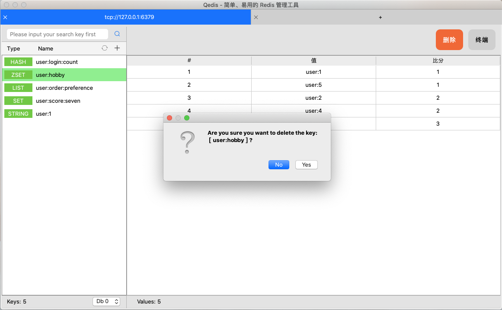

### Qedis 

#### 什么是 Qedis ?

 Qedis 是基于 Qt 开发的 简单、易用 且跨平台 Redis 管理 工具。

#### 终端

 Qedis 自研终端，进入管理界面后，可以点击右上角”终端“按钮进入

### 版本1.0.0

1. 版本 1.0.0 修正上一个版本的几处 bug:

- 修复终端处理命令的时候 **前缀含有空格**，导致命令出错的bug
- 修复右键全选文本后，按下 **任何键或者组合键(ctrl+x)** 导致的终端缓存失效的bug

2. 微调主管理界面样式，右侧的按钮颜色以及字体大小
3. 调整 **数据库切换下拉框** 以及 **文本格式化下拉框** 至下方状态栏
4. **保存** 以及 **删除** 均提示后处理，以防误操作
5. Redis终端现已支持 **关键字高亮** 显示
6. 完整支持 **苹果暗黑模式** 随意切换 

#### 应用截图（如果图片不显示的话，请 百度[github 图片不显示],如果你是科学上网，直接打开全局代理即可）

